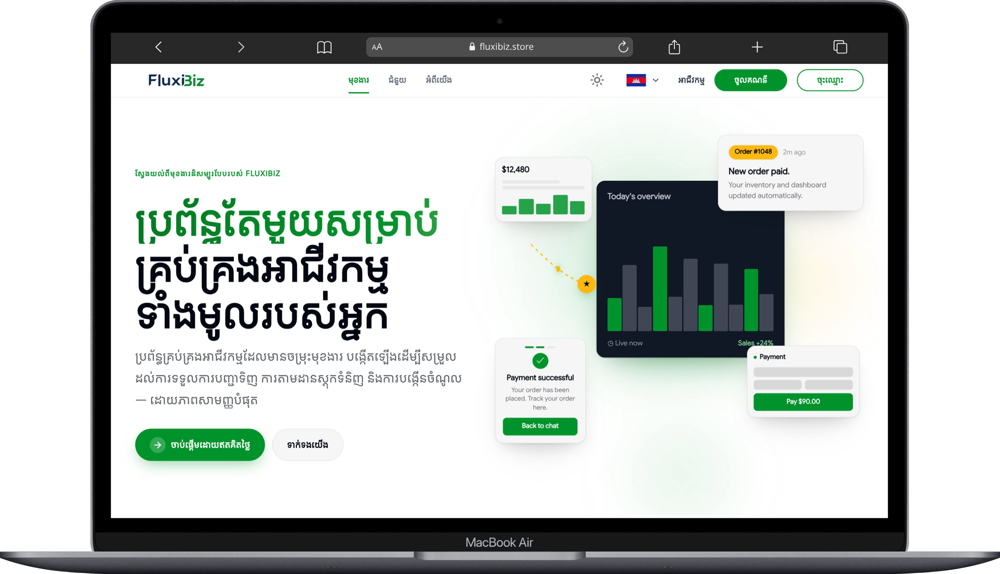
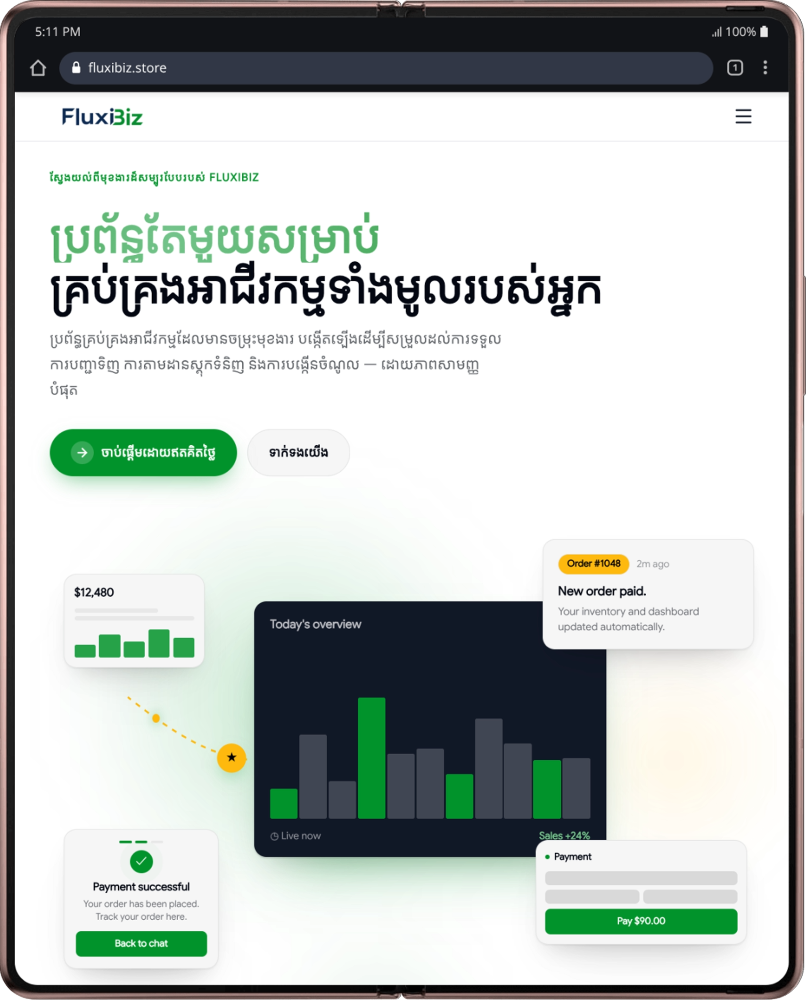

# FluxiBiz

<p align="center">
  
</p>

<p align="center"><b>Run your whole business from one screen.</b></p>

FluxiBiz is an all-in-one point-of-sale, inventory, e-commerce, and business management platform built to centralize and automate the entire lifecycle of modern business operations — across digital and physical marketplaces — for growing teams in Cambodia and beyond.

## What is FluxiBiz?

Most small and medium businesses juggle separate tools for selling in-store, selling online, tracking stock, and managing staff. FluxiBiz replaces that patchwork with a single platform:

- **Point of Sale (POS)** — process in-store sales, manage checkout, and track transactions in real time.
- **Inventory Management** — keep stock levels synced across every sales channel automatically.
- **Online Storefront / E-commerce Marketplace** — give every business a public storefront to sell directly to customers.
- **Business Management** — manage staff, stores, sales channels, and platform resources from one dashboard.

The goal is simple: one platform, every channel, no more switching between disconnected tools to run a business.

## Live Demo

🔗 **[fluxibiz.store](https://fluxibiz.store)** — browse live stores, or [register a business](https://fluxibiz.store/register/business) to try the platform yourself.

## Features

- **Storefront & Marketplace** — public store pages, product browsing, cart, and checkout for customers
  - Store, product, and product-detail pages by slug
  - Per-store cart and checkout flow
  - Promotional banners, managed via an admin API
- **Business Registration & Onboarding** — self-service sign-up flow for new merchants
  - Multi-step signup: account, business, and category selection
- **Sales Channels** — manage and sync multiple channels from one dashboard
- **Inventory & Store Management** — track stock and store details in real time
- **Payments** — checkout and payment history, including Bakong integration
  - Checkout sessions with live payment-status polling
  - Order history and PDF receipts
  - Bakong (KHQR) payment support
- **User Accounts** — customer and staff profiles, authenticated flows
  - Keycloak-backed OAuth login/session
  - Profile editing and picture management
- **Real-time Updates** — STOMP/WebSocket notifications for order/payment status
- **Offline Support** — network status detection and offline fallback UI
- **Multi-language** — i18n support via next-intl (English / Khmer)
- **SEO-ready** — dynamic sitemap, Open Graph/Twitter cards, structured data
- **PWA** — installable, offline-capable app via `@ducanh2912/next-pwa`

---

## Platform Preview
<p align="center">
  
  
  
</p>

## Docs & Links

- [Scalar API Docs](https://sb-ite-basic-course-api-production.up.railway.app/scalar)
- [Download OpenAPI Document ( JSON )](./public/api-document/api.json)
- [Download OpenAPI Document ( YAML )](./public/api-document/api.yaml)

## Getting Started (Developers)

Prerequisites: Node.js v18+
Package manager: **npm** (see `package-lock.json`)

```bash
git clone <repo-url> && cd ipos-frontend
npm install
# create .env.local (see Environment Variables below)
npm run dev    # start dev server — open http://localhost:3000
npm run build  # production build
npm run start  # serve the production build
npm run lint   # run ESLint
```

## Project Structure

```
.
├── public/                    # Static assets (images, icons, ...)
├── src/
│   ├── app/                   # Next.js App Router — pages & routes
│   │   ├── store/             # Public storefront (browse, product, checkout)
│   │   ├── cart/              # Cart
│   │   ├── register/          # User & business registration
│   │   ├── profile/           # Account management
│   │   ├── user-profile/      # Account management
│   │   ├── payment-history/   # Payments & receipts
│   │   ├── receipt/           # Order receipts
│   │   ├── about/             # Marketing page
│   │   ├── feature/           # Marketing page
│   │   ├── support/           # Marketing page
│   │   ├── privacy/           # Legal
│   │   ├── privacy-policy/    # Legal
│   │   ├── offline/           # Offline fallback page
│   │   ├── api/               # Route handlers (auth, health, v1 backend proxy)
│   │   ├── sitemap.ts         # SEO — dynamic sitemap
│   │   ├── robots.ts          # SEO — robots.txt
│   │   ├── layout.tsx         # Root layout
│   │   └── page.tsx           # Landing redirect (/ → /store)
│   ├── components/            # UI components, organized per feature/page
│   ├── features/              # Domain logic (auth, cart, checkout, payment, shop, user, ...)
│   ├── lib/                   # Shared utilities, API clients, SEO helpers, validations
│   ├── hooks/                 # Shared React hooks
│   ├── i18n/                  # next-intl request config
│   └── store/                 # Redux store & hooks
├── next.config.ts             # Next.js configuration
├── eslint.config.mjs          # ESLint configuration
├── tsconfig.json              # TypeScript configuration
├── components.json            # shadcn/ui configuration
└── package.json               # NPM dependencies and scripts
```

## Environment Variables

Create a `.env` (or `.env.local`) with the keys below.

<table width="90%">
  <thead>
    <tr>
      <th width="40%">Key</th>
      <th width="60%">Description</th>
    </tr>
  </thead>
  <tbody>
    <tr>
      <td><code>BETTER_AUTH_SECRET</code></td>
      <td>Secret used to sign/encrypt auth sessions</td>
    </tr>
    <tr>
      <td><code>BETTER_AUTH_URL</code></td>
      <td>Base URL of the auth service</td>
    </tr>
    <tr>
      <td><code>KEYCLOAK_CLIENT_ID</code></td>
      <td>Keycloak client ID used for OAuth login</td>
    </tr>
    <tr>
      <td><code>KEYCLOAK_ISSUER</code></td>
      <td>Keycloak realm issuer URL</td>
    </tr>
    <tr>
      <td><code>API_BASE_URL</code></td>
      <td>Base URL of the backend API the frontend proxies to</td>
    </tr>
    <tr>
      <td><code>NEXT_PUBLIC_WS_URL</code></td>
      <td>Web Socket endpoint: {backend_url}/ws/notifications-sockjs</td>
    </tr>
  </tbody>
</table>


## Errors & Troubleshooting

- 401 / 403: check Bearer token validity and scopes
- 413: request payload too large — reduce size or send in chunks
- CORS errors (browser): ensure the API allows the requesting origin or use the Scalar UI to test server-side


